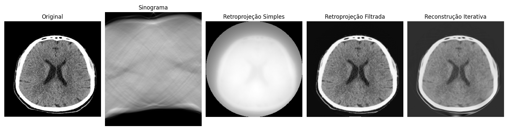

# Reconstrução de Imagens Médicas

Projeto desenvolvido para a disciplina de Informática Médica com o objetivo de demonstrar algoritmos de reconstrução de imagens utilizados em tomografia computadorizada.

---

## Algoritmos Implementados

- Retroprojeção Simples
- Retroprojeção Filtrada (Filtered Backprojection - FBP)
- Reconstrução Iterativa (SART)

---

## Bibliotecas Utilizadas

- NumPy
- Matplotlib
- Scikit-Image

---

## Fluxo do Experimento

Imagem Original → Sinograma → Reconstrução

O sinograma é gerado a partir da Transformada de Radon, simulando os dados brutos de um tomógrafo.

---

## Como Executar

Instale as dependências necessárias:

```bash
pip install numpy matplotlib scikit-image
```

Execute o projeto:

```bash
python main.py
```

---

## Resultado

O código gera e compara três métodos de reconstrução aplicados sobre uma imagem médica.

---

## Comparação dos Métodos

